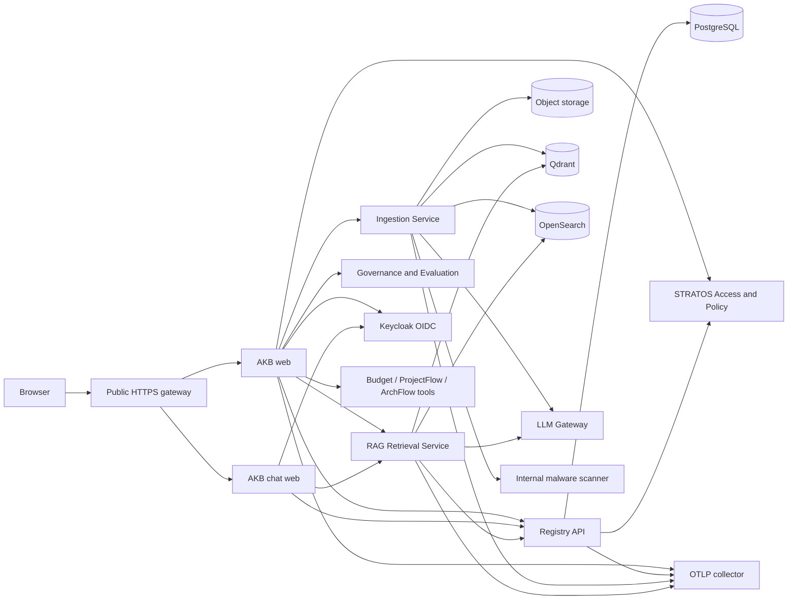

# AKB External Environment Architecture

## Document control

| Field | Value |
| --- | --- |
| Status | Draft; current implementation verified, target topology pending site approval |
| Evidence baseline | AKB `6405261f9279031bb090a85930fad61397fafe47`, 2026-08-26 |
| Owner | AKB architecture owner |
| Approvers | Platform, security, data and integration owners |
| Classification | Internal |

## Architecture decision

**Current verified:** AKB is the source of truth for controlled documents,
their immutable versions, source references, ingestion lineage, chunks,
embeddings, citations and document audit. STRATOS applications remain the
source of truth for business facts such as budgets, projects and needs.

**Current verified:** the only supported production mode is AKB integrated with
Keycloak and STRATOS Access/Information Policy. A local development stack can
run without external STRATOS services, but it is not an autonomous production
security profile.

**Approved target:** a foreign deployment uses private HTTPS/gateway routes
between hosts. Container ports below are internal implementation details and
must not be exposed directly across a server network.

## Logical architecture



There is no browser-to-database, browser-to-object-storage,
browser-to-vector-store, browser-to-search, browser-to-model, or browser-to-
STRATOS-domain-tool path. The web applications are backend-for-frontend
boundaries, not client-side authorization authorities.

## Runtime components

The current production Compose profile defines the following services. Image
names and host placement are site choices; responsibilities are stable.

| Service | Internal port | Responsibility | Canonical state |
| --- | ---: | --- | --- |
| `reverse-proxy` | 8080 | Current single-host ingress and internal routing | Caddy data/config are operational, not document content |
| `platform-status` | 8080 | Shallow health/readiness aggregation | Stateless |
| `web` | 3000 | AKB workspace, OIDC/session boundary, document and integration BFF | Session state is in Registry/PostgreSQL |
| `chat-web` | 3000 | Dedicated employee chat/PWA profile | Same backend authorities; separate public route/client |
| `registry-api` | 8000 | Documents, versions, ACL hints, workflow, policy checks, sessions, audit | PostgreSQL |
| `ingestion-service` | 8090 | Parse/OCR/rendition/chunk/embed/index jobs | File-backed job/rendition work area plus canonical Registry state |
| `rag-retrieval-service` | 8080 | Authorized hybrid retrieval, evidence and citations | Derived retrieval state |
| `llm-gateway-service` | 8080 | Model provider routing and bounded completion/embedding calls | Model-provider state external or mounted |
| `evaluation-service` | 8080 | Retrieval evaluation datasets, runs and reports | Dedicated volumes plus Registry references |
| `governance-service` | 8080 | Comparison, compliance and conflict assistance | Derived results/audit |
| `qdrant` | 6333 | Vector index | Derived, rebuildable from canonical sources |

The development Compose profile additionally supplies local PostgreSQL,
MinIO, OpenSearch, Keycloak, Prometheus, Grafana, Loki and Ollama. Their
presence in development does not imply that they are embedded AKB production
services.

## Data ownership and recovery class

| Data | Authority | Recovery class | Notes |
| --- | --- | --- | --- |
| Document metadata, versions, relationships, workflow, session and audit rows | PostgreSQL through Registry | Canonical | Back up transactionally; restore before derived indexes |
| Original binaries and immutable source objects | S3-compatible object storage | Canonical | Preserve key, size, MIME, SHA-256 and version lineage |
| Upload quarantine | AKB web/host temporary storage | Ephemeral but security-sensitive | Never expose; clean only through governed retention |
| Ingestion attempts and status | Registry/PostgreSQL | Canonical | File job records are operational support, not the sole truth |
| Qdrant vectors | Qdrant | Derived | Rebuild from authorized immutable versions and embedding revision |
| OpenSearch chunks/facets | OpenSearch | Derived | Rebuild; do not copy Lucene data between incompatible versions |
| Office renditions | Ingestion work volume | Derived | Rebuild under rendition engine revision |
| Evaluation datasets/reports | Evaluation volumes and Registry references | Mixed | Classify and back up approved baselines; transient runs may be recreated |
| Secrets and certificates | Site secret manager/PKI | External critical | Never store in Git or ordinary backups without approved encryption |
| Documentation | Git plus approved controlled AKB publication | Canonical operational evidence | Critical recovery subset also needs an offline copy |

Other applications may store AKB document identifiers and exact version
references. They must not copy document bodies, chunks, embeddings or prior
answers as a replacement for AKB.

## Network zones and flows

The current single-host profile uses five Docker networks: `public_zone`,
`app_zone`, `data_zone`, `ai_compute_zone` and `management_zone`. The target
site may implement equivalent controls with Docker networks, Kubernetes network
policies or host firewalls.

| Source | Destination | Purpose | Required property |
| --- | --- | --- | --- |
| User network | Public AKB gateway | HTTPS workspace/chat | TLS, request size limits, sanitized forwarding headers |
| AKB web/chat | Keycloak | Authorization code flow, token refresh/revocation | Trusted issuer, exact redirect URIs and client IDs |
| AKB web/Registry | STRATOS Access/Policy | Fresh projection and decisions | Private HTTPS, fail closed, correlation ID |
| AKB orchestrator | Budget/ProjectFlow/ArchFlow | Director Copilot read-only tools/manifests | Separate audience-bound service token per route |
| AKB services | PostgreSQL writer endpoint | Registry/session/audit data | TLS where supported, expected DB/user verification, no direct replica writes |
| Web/Ingestion | S3-compatible storage | Immutable source objects | Path-style if required, least privilege, no browser route |
| Web/Registry | `clamd` | Malware scan and controlled rescan | Internal TCP only, timeout fails closed |
| Ingestion/RAG | Qdrant and OpenSearch | Derived indexing/retrieval | Separate writer/reader identities where supported |
| Ingestion/RAG | LLM Gateway | Embeddings and answer generation | Caller identity, bounded concurrency, no direct browser access |
| Services | OTLP collector | Sanitized metrics/traces/log correlation | No bodies, tokens, prompts, answers or document content |

**Open decision:** exact FQDNs, IP addresses, VLANs, gateways, NAT, firewall
rules, DNS, NTP, certificate issuers and service placement must be approved for
each site. Do not copy `*.home.cz`, private IPs, Docker subnets or port mappings
from the current environment as universal values.

## Identity and authorization boundary

1. The browser completes OIDC Authorization Code Flow with PKCE.
2. AKB creates an opaque server-side session. Tokens are encrypted server-side;
   the browser receives only a secure session selector cookie.
3. AKB reloads the current STRATOS access projection. Capabilities and scopes
   are not durable session authority.
4. Registry evaluates document/action authorization and Information Policy.
5. RAG filters every candidate through Registry before composition.
6. Service-to-service calls use distinct client credentials, exact audiences,
   allowlisted client identities and route grants.
7. Unknown, stale, unavailable or inconsistent identity/policy state denies the
   operation.

Autonomous production AKB needs an equivalent native authority for steps 3 and
4. Static OIDC claims, user prompts or unverified headers are not substitutes.

## API and contract boundaries

`openapi/openapi.json` is the repository-level binding API index. Service-local
OpenAPI documents remain detailed contracts and must stay aligned through
`scripts/generate_openapi_index.rb`. Existing error envelopes use `trace_id`;
an external adapter must not silently rename or drop it.

| Surface | Exposure | Purpose and authority |
| --- | --- | --- |
| Public AKB web/chat routes | Public HTTPS gateway | OIDC/session, UI and browser BFF only |
| `/akb/api/health`, `/akb/api/ready` | Public/monitoring according to site policy | Process liveness and dependency-aware readiness; no secret details |
| Registry `/api/v1` | Private application network | Canonical document/version/workflow/authz/audit API |
| Ingestion `/api/v1` | Private application network | Bounded job submission/status/cancel with Registry-issued authority |
| RAG `/api/v1` | Private application network through web BFF | Authorized retrieval, assistant and citation context |
| LLM Gateway `/api/v1` | Private AI network | Audience-bound embedding/completion provider routing |
| Governance/Evaluation `/api/v1` | Private application network | Compliance/comparison and quality evaluation |
| Document Intake/public delivery bridges | Approved AKB integration gateway | Signed/authorized immutable document intake and delivery; never direct S3 |
| Controlled Rules read integration | Approved AKB service route | Time-effective, citation-bound and policy-filtered rules for an audience-bound client |
| STRATOS Access/Policy/resource APIs | Private HTTPS external dependency | Current projection, decisions and governed-resource registration |
| Budget/ProjectFlow/ArchFlow manifests/tools | Private HTTPS external dependency | Read-only source facts with source-side PEP and pinned contract |

Do not create an undocumented endpoint, expose a private service to solve a
routing problem, or treat health output as a business-data API.

## Critical request paths

### Document upload

```text
browser -> web preflight -> quarantine -> clamd INSTREAM -> S3 durable write
       -> Registry immutable version -> Registry-issued ingestion authority
       -> parse/OCR/rendition -> embeddings -> Qdrant/OpenSearch -> INDEXED
```

An error at scan, storage, Registry, embedding or index validation never marks
the document clean, published or indexed.

### Document question

```text
browser -> web/chat -> current access projection -> RAG
       -> Registry filter -> Qdrant/OpenSearch -> evidence selection
       -> LLM Gateway -> citation validation -> persisted governed response
```

Document RAG cannot replace a controlled rule or a live business value.

### Live STRATOS question

```text
browser -> web/chat -> deterministic planner -> current projection
       -> pinned manifest + target-specific service token -> source PEP
       -> evidence gate -> optional separately cited document context -> answer
```

A transport failure, manifest drift, authorization denial or incomplete cursor
chain is rendered explicitly and cannot fall back to documents.

## Availability and scaling constraints

- **Current verified:** most services are stateless and can be rebuilt from
  images and canonical stores, but Registry/PostgreSQL and source storage are
  critical stateful dependencies.
- **Current verified:** production ingestion still processes a file-backed job
  store inline. It is not a durable multi-worker queue and has no documented
  dead-letter queue.
- **Current verified:** default embedding, reranker and evaluation concurrency
  is deliberately bounded to protect shared resources.
- **Open decision:** HA topology, worker count, storage class, capacity,
  autoscaling and node anti-affinity require measured workload evidence.
- **Approved target:** readiness must express dependency degradation; load
  balancers must not route a service that cannot safely serve its contract.

Size a pilot from document count and format mix, peak uploads, OCR ratio,
embedding throughput, concurrent chat users, retrieval latency and retention.
Do not publish a universal VM minimum without this measurement.

## Related evidence

- `docs/architecture.md`
- `docs/ARCHITECTURE/02_SERVICE_BOUNDARIES.md`
- `infra/docker-compose/docker-compose.docker-home.yml`
- `docs/security/access-information-policy-v2.md`
- `docs/integration/AKB_DOCUMENT_INTAKE_V1.md`
- `docs/integration/DIRECTOR_COPILOT_V2_IMPLEMENTATION.md`
